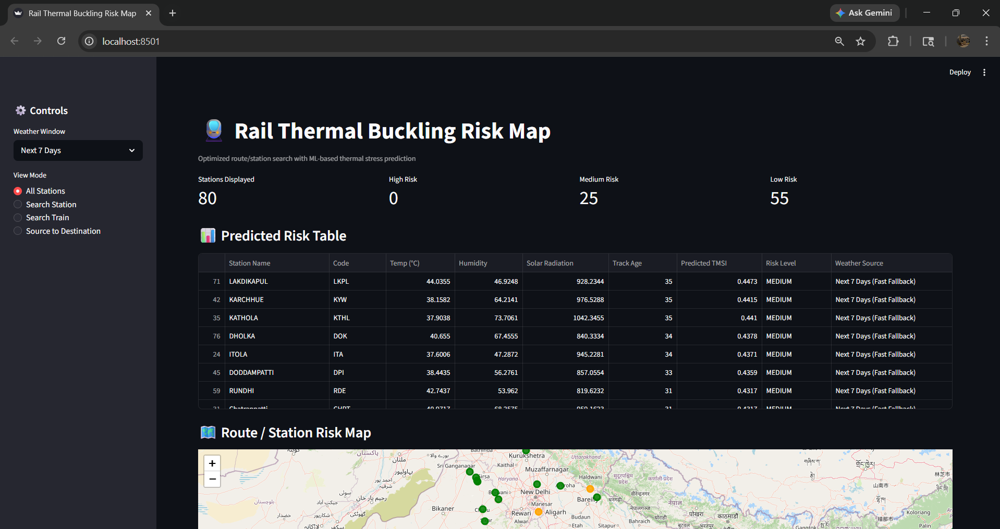
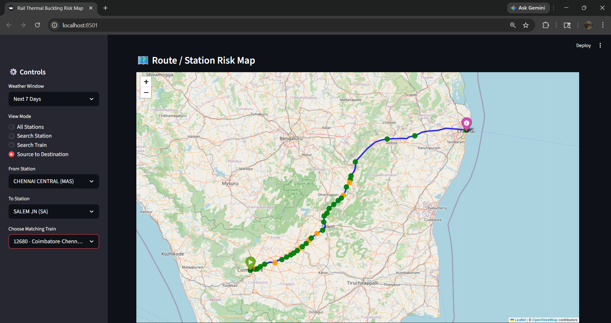
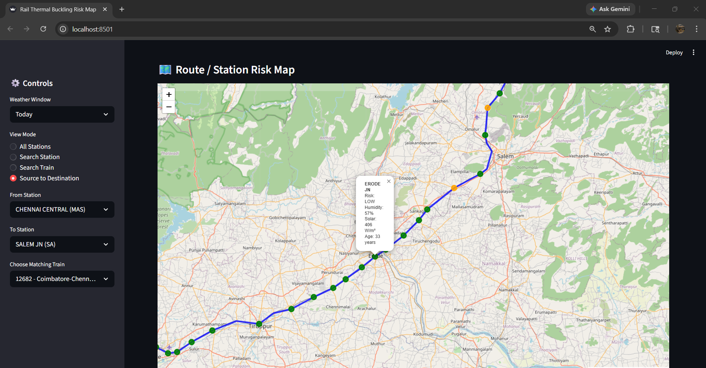
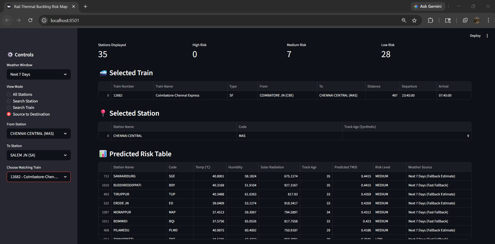

# 🚆 Smart Thermal Stress Detection for Rail Tracks


### 🔍 Predicting railway track buckling risk caused by thermal stress using Machine Learning

---

## 📖 Overview

Railway tracks made of continuously welded steel are highly sensitive to thermal stress caused by environmental temperature variations. When rails expand due to high temperatures and the expansion is constrained, compressive stress builds up within the track structure.

If this stress exceeds safe limits, it can lead to track buckling, a dangerous deformation that may result in derailments and major operational failures.

This project presents a machine learning-based predictive system that estimates thermal stress levels using environmental and geographical data, enabling early risk detection and preventive maintenance.

## 🧠 What This Project Does

This system predicts thermal stress levels in railway tracks and identifies sections that are potentially at risk of buckling.

Instead of relying on manual inspection or fixed thresholds, the model:

* Learns patterns from historical data
* Predicts stress conditions dynamically
* Helps detect risks before physical failure occurs

## ⚙️ How It Works (Core Logic)

The system uses multiple input parameters such as:

* Temperature
* Geographic conditions
* Track characteristics
* Historical stress patterns

These features are processed and passed into an XGBoost Regression model, which captures non-linear relationships between temperature and stress, handles complex feature interactions, and produces accurate stress predictions.

The output is a predicted thermal stress value, which can be used to identify high-risk zones, support preventive maintenance, and reduce the likelihood of track failure.

## 🤖 Why XGBoost?

XGBoost is chosen because it performs well on structured data, handles non-linear relationships effectively, is robust to noise and feature variations, and provides higher accuracy than traditional regression models.

## 🚨 Why This Matters

Traditional railway monitoring systems depend heavily on manual inspection, use fixed safety thresholds, and may fail to detect early warning signs.

This system enables data-driven decision making, supports early detection of buckling conditions, and helps reduce accidents and maintenance costs.

## 🎯 Objectives

* Analyze climate and railway-related data
* Build a regression model for thermal stress prediction
* Evaluate performance using standard metrics
* Develop a scalable and cost-effective solution

## 🧠 Machine Learning Approach

* Problem Type: Regression
* Algorithm: XGBoost Regressor
* Learning Type: Supervised Learning

## 🔄 Workflow

1. Data Collection
2. Data Preprocessing
3. Feature Engineering
4. Model Training
5. Model Evaluation
6. Thermal Stress Prediction

## 🖥️ Application Preview

### 📊 Dashboard

<p align="center">
  
</p>

### 🗺️ Railway Routes Visualization

<p align="center">
  
</p>

### 📍 Interactive Popup Insights

<p align="center">
  
</p>

### 📋 Tabular Data View

<p align="center">
  
</p>

## ⚙️ Technology Stack

* Python
* Pandas, NumPy
* Scikit-learn
* XGBoost
* Matplotlib
* Streamlit

## 🚀 Installation & Setup

### 1️⃣ Clone Repository

```bash id="9n5d6h"
git clone https://github.com/sakthinavaneetha/RailwayBucklingRiskMap.git
cd RailwayBucklingRiskMap
```

### 2️⃣ Create Virtual Environment

```bash id="k2v4rm"
python -m venv venv
```

### 3️⃣ Activate Environment (Windows)

```bash id="2z8qje"
venv\Scripts\activate
```

### 4️⃣ Install Dependencies

```bash id="8x5h2v"
pip install -r requirements.txt
```

### 5️⃣ Run Application

```bash id="4v3pqe"
streamlit run streamlit_app.py
```

## 📁 Project Structure

```id="d1r9m0"
RailwayBucklingRiskMap/
│
├── assests/                
├── data/                  
├── ml_pipeline/           
├── streamlit_app.py       
├── weather_service.py     
├── requirements.txt
```

## 📊 Model Details

* Model Type: Regression
* Algorithm: XGBoost
* Output: Thermal stress value
* Use Case: Early detection of track buckling risk

## 🚀 Applications

* Railway safety monitoring
* Predictive maintenance
* Infrastructure risk assessment
* Intelligent transportation systems

